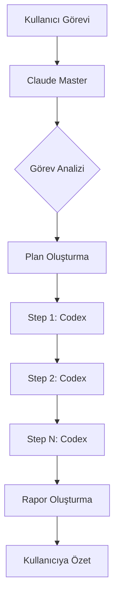

# 🎯 ClaudeToCodex - Master-Slave CLI Orchestration System

## 🚀 Genel Bakış

Bu sistem, **Claude'u Master (Planlayıcı)** ve **Codex'i Slave (Executor)** olarak kullanarak görevleri otomatik olarak yaptırmanızı sağlar.

### Çalışma Mantığı:
```
Kullanıcı → Claude (Master) → Plan Oluşturma → Codex (Slave) → Execution → Rapor
```

## 📦 Kurulum

```bash
# Script'leri executable yap
chmod +x codex-orchestrator.py codex-master.py

# Codex CLI'ın kurulu olduğunu doğrula
~/.npm-global/bin/codex --version
```

## 🎮 Kullanım Yöntemleri

### 1️⃣ **Claude (Master) Olarak Kullanım**

Ben (Claude) sizin için görevleri planlayıp Codex'e yaptırabilirim:

```python
# Python'dan çağırma
from codex_master import master_execute_task

# Örnek: Proje oluşturma
result = master_execute_task(
    task_type='create_project',
    task_description='Create a Flask REST API with authentication'
)

# Örnek: Bug fix
result = master_execute_task(
    task_type='debug_fix', 
    task_description='Fix the database connection error in app.py'
)
```

### 2️⃣ **Hızlı Tek Komut**

```bash
# Terminal'den direkt kullanım
python3 codex-master.py "Create a README.md file with project description"
```

### 3️⃣ **Custom Plan ile Kullanım**

```python
from codex_master import MasterController

master = MasterController()

# Özel plan oluştur
plan = master.create_plan(
    task="Build a web scraper for HackerNews",
    steps=[
        {
            'description': 'Create project structure',
            'instruction': 'Create web_scraper directory with src and tests folders',
            'critical': True
        },
        {
            'description': 'Install dependencies',
            'instruction': 'Create requirements.txt with requests, beautifulsoup4',
            'critical': True
        },
        {
            'description': 'Implement scraper',
            'instruction': 'Create src/scraper.py with HackerNewsScraper class that fetches top stories',
            'critical': True
        },
        {
            'description': 'Add example usage',
            'instruction': 'Create example.py showing how to use the scraper',
            'critical': False
        }
    ]
)

# Planı çalıştır
report = master.execute(plan)
```

## 📋 Hazır Task Template'leri

### `create_project`
- Proje dizin yapısı oluşturma
- Git repository başlatma
- README.md oluşturma

### `add_feature`
- Mevcut kodu analiz etme
- Yeni özellik ekleme
- Test yazma

### `debug_fix`
- Hatayı tanımlama
- Düzeltme yapma
- Fix'i doğrulama

### `refactor`
- Kod kalitesini analiz etme
- Refactoring yapma
- Testleri çalıştırma

## 🔧 Özellikler

### Auto-Approve Mode
Codex otomatik onay modunda çalışır (`CODEX_AUTO_APPROVE=true`)

### Timeout Protection
Her komut için 5 dakika timeout

### Error Handling
- Kritik adımlarda hata olursa plan durur
- Non-kritik adımlarda devam eder

### Execution Logging
- Her execution JSON rapor olarak kaydedilir
- Detaylı log ve sonuçlar

## 📊 Rapor Formatı

Her görev sonunda:
```json
{
  "summary": {
    "total_steps": 4,
    "completed_steps": 3,
    "success_rate": "75.0%",
    "execution_time": "2024-01-07T..."
  },
  "steps": [...],
  "logs": [...]
}
```

## 🎯 Örnek Senaryo

**Senaryo**: Flask API projesi oluştur

**Sen**: "Flask REST API with JWT authentication projesi oluştur"

**Ben (Claude)**: 
1. Görevi analiz ederim
2. Plan oluştururum:
   - Proje yapısı
   - Dependencies
   - Flask app
   - JWT auth
   - Example endpoints
3. Codex'e adım adım yaptırırım
4. Sonuç raporunu sunarım

## ⚙️ Environment Variables

```bash
# Codex auto-approve için
export CODEX_AUTO_APPROVE=true
```

## 🚨 Troubleshooting

### Codex bulunamadı
```bash
# Path'i kontrol et
ls ~/.npm-global/bin/codex

# Yoksa kur
npm install -g @codex/cli
```

### Timeout hatası
- Instruction'ları daha küçük parçalara böl
- Critical flag'i False yap

### Permission hatası
```bash
chmod +x codex-*.py
```

## 🤝 Master-Slave İş Akışı



## 💡 İpuçları

1. **Küçük adımlar**: Büyük görevleri küçük adımlara böl
2. **Clear instructions**: Codex için net talimatlar
3. **Context kullan**: Gerektiğinde context parametresi ekle
4. **Critical flag**: Önemli adımları critical=True yap
5. **Test et**: Önce basit görevlerle test et

## 📝 Notlar

- Codex'in tüm sorumluluğu Master'da (Claude)
- Context minimizasyonu için Codex kullanılıyor
- Her görev JSON rapor olarak saklanıyor
- Hata durumunda detaylı log

---

**Hazır mısın?** Bana bir görev ver, plan yapıp Codex'e yaptırayım! 🚀