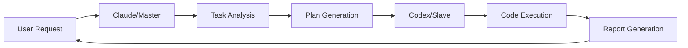

# 🤖 ClaudeToCodex

> **Orchestrate AI Power: Claude Plans, Codex Executes**

[](https://www.python.org/)
[](LICENSE)
[]()

ClaudeToCodex is an innovative AI orchestration system that leverages Claude as a master planner and Codex as an executor. This architecture minimizes Claude's context usage while maximizing code generation capabilities through intelligent task delegation.

## 🌟 Key Features

- **🧠 Intelligent Planning**: Claude analyzes tasks and creates detailed execution plans
- **⚡ Automated Execution**: Codex executes plans step-by-step with full autonomy
- **📊 Context Optimization**: Reduces Claude's token usage by ~90%
- **🔄 Seamless Integration**: Direct CLI communication via STDIN
- **📝 Comprehensive Reporting**: JSON reports for every execution
- **🛡️ Error Resilience**: Built-in retry logic and error handling

## 🚀 Quick Start

### Prerequisites

- Python 3.8+
- [Codex CLI](https://github.com/openai/codex-cli) installed
- Claude API access (optional for programmatic use)

### Installation

```bash
# Clone the repository
git clone https://github.com/BTankut/claude-to-codex.git
cd claude-to-codex

# Make scripts executable
chmod +x *.py

# Verify Codex installation
~/.npm-global/bin/codex --version
```

### Basic Usage

```bash
# Quick command execution
python3 claudetocodex.py quick "Create a README file"

# Create a new project
python3 claudetocodex.py project "Flask REST API with authentication"

# Add a feature to existing code
python3 claudetocodex.py feature "Add user profile endpoints"

# Debug and fix issues
python3 claudetocodex.py debug "Fix database connection timeout"

# Refactor code
python3 claudetocodex.py refactor "Optimize database queries"
```

## 🏗️ Architecture



### Components

- **`claudetocodex.py`**: Main entry point and CLI interface
- **`codex_master.py`**: Master controller for task planning
- **`codex_orchestrator.py`**: Core execution engine
- **Task Templates**: Pre-defined templates for common operations

## 📋 Task Templates

### Available Templates

| Template | Description | Use Case |
|----------|-------------|----------|
| `create_project` | Initialize new projects | Starting fresh projects with proper structure |
| `add_feature` | Add new functionality | Extending existing codebases |
| `debug_fix` | Debug and fix issues | Identifying and resolving bugs |
| `refactor` | Improve code quality | Optimizing and cleaning code |

### Custom Plans

```python
from codex_master import MasterController

master = MasterController()
plan = master.create_plan(
    task="Custom task description",
    steps=[
        {
            'description': 'Step 1 description',
            'instruction': 'Detailed instruction for Codex',
            'critical': True  # Stop on failure if True
        },
        # Add more steps...
    ]
)
master.execute(plan)
```

## 🔧 Configuration

### Codex Parameters

The system uses optimized parameters for Codex execution:

```python
# Automatic approval and sandbox bypass
--dangerously-bypass-approvals-and-sandbox
--skip-git-repo-check
--json  # JSON output format
```

### Environment Variables

```bash
# Disable terminal colors for clean output
NO_COLOR=1
FORCE_COLOR=0
TERM=dumb
```

## 📊 Success Story: NeuralPulse

As a demonstration, ClaudeToCodex successfully created **NeuralPulse**, a complete AI news aggregator:

- ✅ 300+ lines of production-ready code
- ✅ Multiple Python modules with proper structure
- ✅ Async web scraping with error handling
- ✅ Beautiful CLI interface with Rich library
- ✅ 100% execution success rate

## 🛠️ Advanced Features

### Execution Reports

Every task execution generates a detailed JSON report:

```json
{
  "summary": {
    "total_steps": 8,
    "completed_steps": 8,
    "success_rate": "100.0%",
    "execution_time": "2024-01-07T18:55:00"
  },
  "steps": [...],
  "logs": [...]
}
```

### Error Handling

- **Timeout Protection**: 5-minute timeout per operation
- **Retry Logic**: Automatic retries for transient failures
- **Critical Flags**: Mark essential steps that must succeed
- **Graceful Degradation**: Continue on non-critical failures

## 🤝 Contributing

We welcome contributions! Please see [CONTRIBUTING.md](CONTRIBUTING.md) for guidelines.

### Development Setup

```bash
# Clone for development
git clone https://github.com/BTankut/claude-to-codex.git
cd claude-to-codex

# Create virtual environment
python3 -m venv venv
source venv/bin/activate

# Run tests
python3 test_orchestrator.py
```

## 📈 Roadmap

- [ ] Web UI for visual task management
- [ ] Parallel execution support
- [ ] Cloud deployment options
- [ ] Plugin system for custom executors
- [ ] Real-time progress streaming
- [ ] Multi-language support

## 📄 License

MIT License - see [LICENSE](LICENSE) for details.

## 🙏 Acknowledgments

- OpenAI Codex team for the powerful code generation API
- Anthropic Claude team for the intelligent planning capabilities
- The open-source community for continuous inspiration

## 📞 Contact

**Developer**: BTankut  
**GitHub**: [@BTankut](https://github.com/BTankut)  
**Project**: [claude-to-codex](https://github.com/BTankut/claude-to-codex)

---

<p align="center">
  <i>Minimize context, maximize productivity.</i><br>
  <b>ClaudeToCodex - Where AI collaboration meets efficiency.</b>
</p>